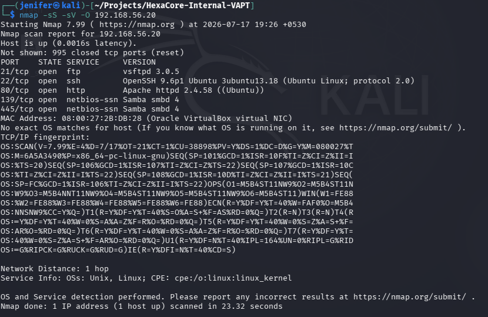
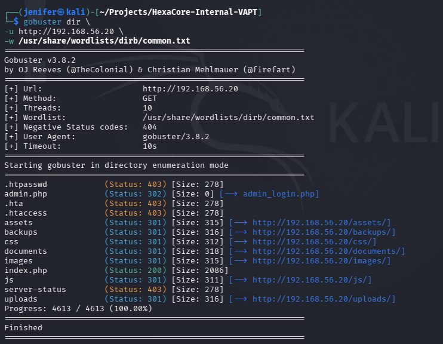
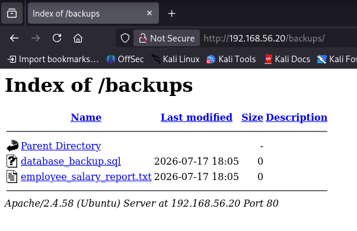

# Enterprise Security Assessment and Hardening Lab

## Project Overview

This project demonstrates the design, deployment, and security assessment of a simulated enterprise environment developed for learning and demonstrating practical cybersecurity skills.

The lab was built to replicate a realistic corporate infrastructure named **HexaCore Technologies Pvt. Ltd.** and includes multiple services, intentionally introduced vulnerabilities, and a complete Vulnerability Assessment and Penetration Testing (VAPT) engagement.

The assessment was performed from a Kali Linux attacker machine against the enterprise server, following an industry-style penetration testing methodology. The project covers reconnaissance, enumeration, vulnerability assessment, exploitation, privilege escalation, reporting, and remediation planning.

This repository contains the project documentation, assessment report, supporting screenshots, and methodology followed throughout the engagement.

## Objectives

The primary objectives of this project were:

- Design and deploy a realistic enterprise lab environment using VirtualBox.
- Configure multiple enterprise services including Apache, PHP, MariaDB, SSH, FTP, and SMB.
- Introduce intentionally vulnerable configurations to simulate real-world security weaknesses.
- Perform a complete Vulnerability Assessment and Penetration Testing (VAPT) engagement from a Kali Linux attacker machine.
- Identify, validate, and document security vulnerabilities using industry-standard tools.
- Demonstrate exploitation techniques and privilege escalation within a controlled lab environment.
- Produce a professional VAPT report containing technical findings, risk ratings, evidence, and remediation recommendations.

## Lab Environment

The assessment was performed in a controlled virtualized enterprise environment designed to simulate a real-world corporate network.

**Host Machine**
- Windows 11

**Virtualization Platform**
- Oracle VirtualBox

**Attacker Machine**
- Kali Linux

**Target Machine**
- Ubuntu Server 24.04 LTS

**Services Configured**
- Apache2 Web Server
- PHP
- MariaDB
- OpenSSH
- vsftpd (FTP)
- Samba (SMB)

The environment was intentionally configured with multiple security weaknesses to simulate an enterprise infrastructure suitable for vulnerability assessment, penetration testing, and remediation exercises.
The vulnerable enterprise environment was designed to simulate a realistic corporate infrastructure where multiple services were intentionally configured with security weaknesses for assessment and remediation practice.

## Tools Used

The following tools were used throughout the Vulnerability Assessment and Penetration Testing (VAPT) engagement.

**Reconnaissance & Enumeration**
- Nmap
- Gobuster
- Nikto

**Web Application Testing**
- Burp Suite Community Edition
- Firefox
- curl

**Authentication Testing**
- Hydra

**SMB Enumeration**
- NetExec (CrackMapExec)
- enum4linux

**Privilege Escalation**
- LinPEAS
- Linux Terminal

**Reporting & Documentation**
- Microsoft Word
- GitHub


## Assessment Methodology

The assessment followed a structured penetration testing methodology to identify, validate, and document security vulnerabilities within the simulated enterprise environment.

The methodology consisted of the following phases:

1. **Lab Design & Deployment**
   - Built a virtual enterprise infrastructure using Oracle VirtualBox.
   - Configured Ubuntu Server as the target machine and Kali Linux as the attacker machine.
   - Installed and configured enterprise services such as Apache, PHP, MariaDB, SSH, FTP, and SMB.

2. **Reconnaissance**
   - Identified live hosts and discovered exposed network services.
   - Performed port scanning to identify the attack surface.

3. **Enumeration**
   - Enumerated web directories, files, SMB shares, FTP services, and application endpoints.
   - Collected information required for further exploitation.

4. **Vulnerability Assessment**
   - Identified security weaknesses through automated scanning and manual verification.
   - Validated vulnerabilities to eliminate false positives.

5. **Exploitation**
   - Exploited identified vulnerabilities in a controlled manner to demonstrate their impact.
   - Gained initial access to the target system.

6. **Privilege Escalation**
   - Enumerated the compromised system.
   - Identified privilege escalation vectors and obtained administrative (root) access.

7. **Reporting**
   - Documented all findings with supporting evidence.
   - Assigned risk ratings and provided remediation recommendations.
  
## Attack Workflow

The following workflow illustrates the approach followed during the Vulnerability Assessment and Penetration Testing (VAPT) engagement.

```
Enterprise Lab Design
        │
        ▼
Service Configuration
(Apache, PHP, MariaDB, SSH, FTP, SMB)
        │
        ▼
Vulnerability Creation
        │
        ▼
Reconnaissance
(Nmap)
        │
        ▼
Enumeration
(Gobuster, SMB, FTP)
        │
        ▼
Vulnerability Assessment
        │
        ▼
Exploitation
        │
        ▼
Privilege Escalation
        │
        ▼
Evidence Collection
        │
        ▼
Professional VAPT Report
```

The assessment followed a systematic approach beginning with reconnaissance and enumeration, followed by vulnerability validation, controlled exploitation, privilege escalation, evidence collection, and the preparation of a professional VAPT report with remediation recommendations.

## Vulnerabilities Identified

The following vulnerabilities were intentionally introduced into the simulated enterprise environment and successfully identified during the VAPT engagement.

### HC-VULN-01 – Directory Listing Enabled
- Sensitive directories were accessible through directory listing, exposing internal files to unauthorized users.

### HC-VULN-02 – Backup File Disclosure
- Backup files containing sensitive application configuration and database credentials were publicly accessible.

### HC-VULN-03 – SQL Injection
- The web application was vulnerable to SQL Injection, allowing unauthorized access to backend database information.

### HC-VULN-04 – Unrestricted File Upload
- The application allowed unrestricted file uploads, creating the possibility of uploading malicious files.

### HC-VULN-05 – Weak FTP Configuration
- The FTP service contained weak authentication and configuration issues that could lead to unauthorized access.

### HC-VULN-06 – SMB Information Disclosure
- Misconfigured SMB shares allowed excessive information disclosure during enumeration.

### HC-VULN-07 – Linux Privilege Escalation
- A local privilege escalation path was identified, allowing elevation from a standard user account to root privileges.


## Assessment Screenshots

The following screenshots capture key stages of the Vulnerability Assessment and Penetration Testing (VAPT) engagement conducted against the simulated enterprise environment.

### 1. Network Reconnaissance

#### Nmap Port Scan


---

### 2. Web Enumeration

#### Gobuster Directory Enumeration


#### Discovered Backup Directory


---

### 3. Backup File Exposure

#### Exposed Backup File


#### Sensitive Configuration Disclosure


---

### 4. SQL Injection

#### SQL Injection Validation


#### Database Extraction


---

### 5. Unrestricted File Upload

#### Upload Function Identified


#### Malicious File Uploaded


#### Uploaded File Executed


---

### 6. File Access Verification

#### Uploaded File Access


---

### 7. SMB Enumeration

#### SMB Share Discovery


#### SMB Share Enumeration


#### Sensitive Files Accessed


---

### 8. Privilege Escalation

#### Privilege Escalation Enumeration


#### Root Access Achieved


## Skills Demonstrated

This project demonstrates practical experience in:

- Enterprise Lab Design and Deployment
- Vulnerability Assessment and Penetration Testing (VAPT)
- Network Reconnaissance and Enumeration
- Web Application Security Testing
- SQL Injection Testing
- File Upload Security Testing
- FTP and SMB Enumeration
- Linux Privilege Escalation
- Risk Assessment and Vulnerability Reporting
- Security Documentation and Remediation Planning

## Project Report

The complete professional Vulnerability Assessment and Penetration Testing (VAPT) report for this project is available below.

📄 **Report:** [HexaCore Technologies VAPT Report](Report/HexaCore_Technologies_VAPT_Report.pdf)

## Author

**Jenifer Catherine D**

Aspiring Cybersecurity Professional | VAPT | Application Security | Network Security

GitHub: https://github.com/JeniferD29
Linkedin: https://www.linkedin.com/in/jenifercatherined/
TryHackMe: https://tryhackme.com/p/djenifercatherine
